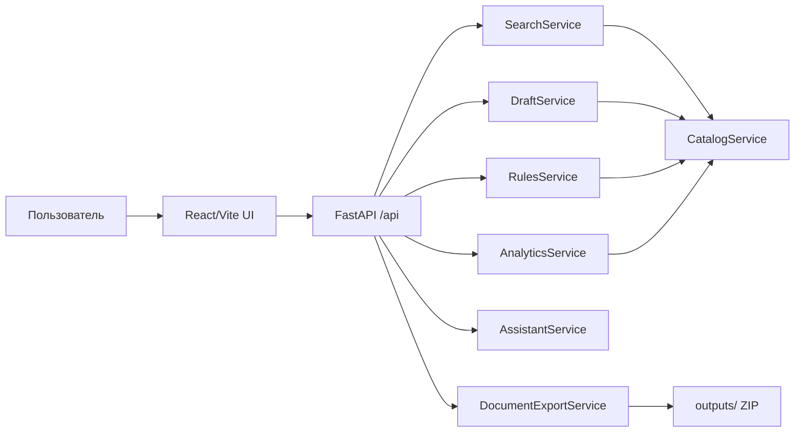

# Архитектура PROSTOR MVP

## 1. Общая схема

## 2. Ключевая доменная модель

Центральный объект — `RequestDraft`.

Он хранит:

- выбранный продукт;
- исполнителя и договор;
- структуру этапов;
- обязательные поля;
- введенные пользователем данные;
- риски и рекомендации;
- процент готовности;
- статусы документов пакета.

Такой объект связывает поиск, конструктор, правила качества, ассистента и экспорт документов.

## 3. Компоненты backend

- `CatalogService` — демо-каталог компаний, договоров, продуктов, шаблонов и исторических кейсов.
- `SearchService` — ранжирует продукты и формирует объяснения, исполнителей, аналоги и рекомендации.
- `DraftService` — создает черновик из результата поиска.
- `RulesService` — проверяет полноту и договорные/методические риски.
- `DocumentExportService` — генерирует пакет `DOCX + XLSX + XLSX` и ZIP-архив.
- `AnalyticsService` — отдает агрегированную сводку для дашборда.
- `AssistantService` — дает контекстные подсказки в интерфейсе.

## 4. Компоненты frontend

- Вкладка **Поиск** — естественный запрос, карточки продуктов, объяснения, исполнители, аналоги.
- Вкладка **Конструктор** — форма ключевых полей, готовность, риски, документы, структура ТЗ.
- Вкладка **Аналитика** — метрики и частые паттерны.
- Боковой ассистент — подсказки по выбранному продукту и текущему черновику.

## 5. Поток демо-сценария

1. Пользователь вводит: "Нужно оценить запасы по объекту и подготовить проектно-технический документ".
2. `SearchService` выбирает "Подсчёт запасов / ПТД".
3. UI показывает причины, исполнителей и аналоги.
4. Пользователь нажимает "Сформировать ТЗ".
5. `DraftService` создает `RequestDraft`.
6. `RulesService` считает готовность и риски.
7. Пользователь включает необходимость 3D-модели и видит риски по исходным данным.
8. Пользователь экспортирует ZIP-пакет документов.

## 6. Расширяемость

В промышленной версии можно добавить:

- загрузку всего каталога из XLSX/ERP вместо статического демо-каталога;
- полнотекстовый и векторный поиск;
- LLM-слой для уточняющего диалога и генерации формулировок;
- версионирование шаблонов ТЗ;
- авторизацию и роли;
- сохранение заявок в БД;
- интеграцию с документооборотом и договорными системами.
